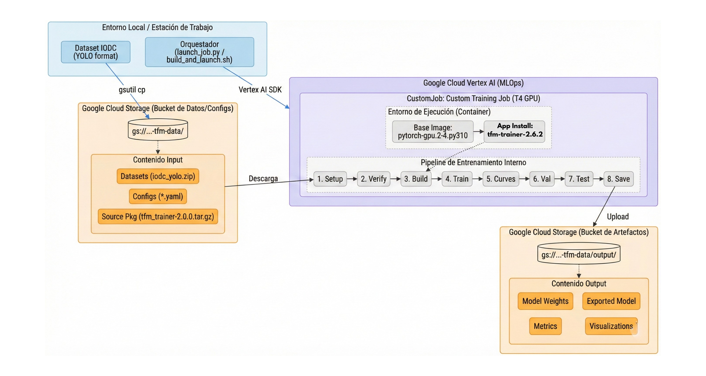

<!-- Badges -->
<p align="center">
  
  
  
  
  
  
  
</p>

<!-- Título -->
<h1 align="center">TFM — Detección de Objetos TinyML en ESP32-S3<br/>para Asistencia a Personas con Movilidad Reducida</h1>

<p align="center">
  <strong>Sistema de visión artificial embebida para la detección en tiempo real de obstáculos y elementos del entorno, desplegado en un microcontrolador ESP32-S3 con cámara OV5640.</strong>
</p>

> **Trabajo Fin de Máster** · Universidad Internacional de La Rioja (UNIR)  
> **Autor:** Jeisson Martinez Florez

---

<!-- Diagrama de arquitectura MLOps -->
<p align="center">
  
</p>
<p align="center"><em>Pipeline MLOps end-to-end: desde la adquisición de datos hasta el despliegue en dispositivo.</em></p>

---

## Tabla de Contenidos

1. [Descripción del Proyecto](#1-descripción-del-proyecto)
2. [Características Principales](#2-características-principales)
3. [Arquitectura del Proyecto](#3-arquitectura-del-proyecto)
4. [Estructura del Repositorio](#4-estructura-del-repositorio)
5. [Stack Tecnológico](#5-stack-tecnológico)
6. [Dataset](#6-dataset)
7. [Modelos Evaluados](#7-modelos-evaluados)
8. [Pipeline de Cuantización](#8-pipeline-de-cuantización)
9. [Hardware](#9-hardware)
10. [Ciclos de Despliegue](#10-ciclos-de-despliegue)
11. [Requisitos Previos](#11-requisitos-previos)
12. [Instalación y Uso Rápido](#12-instalación-y-uso-rápido)
13. [Resultados](#13-resultados)
14. [Documentación Adicional](#14-documentación-adicional)
15. [Autor y Créditos](#15-autor-y-créditos)
16. [Licencia](#16-licencia)

---

## 1. Descripción del Proyecto

Este Trabajo Fin de Máster aborda el diseño, entrenamiento y despliegue de un **sistema de detección de objetos en tiempo real** ejecutado íntegramente en un microcontrolador **ESP32-S3**, orientado a la **Robótica Móvil de Bajo Coste (LCMR)**.

El sistema detecta **5 clases de objetos** relevantes para la navegación en entornos cotidianos:

| Clase | Descripción |
|:---:|:---|
| `dog` | Mascotas que pueden suponer un obstáculo imprevisto |
| `door` | Puertas y accesos transitables |
| `obstacle` | Objetos genéricos que bloquean el paso |
| `person` | Personas en el entorno de navegación |
| `stair` | Escaleras — barrera crítica para movilidad reducida |

La solución captura imágenes QVGA (320×240) mediante una cámara OV5640, ejecuta inferencia INT8 on-device con un modelo de **361K parámetros** (~545 KB), y transmite los resultados en tiempo real a un **dashboard web embebido** accesible vía WiFi, logrando tiempos de inferencia de **~405 ms** (~1.5–1.8 FPS).

El proyecto implementa un **ciclo completo de ingeniería MLOps** estructurado en 4 fases, desde la adquisición y curación de datos hasta el despliegue optimizado en dispositivo.

---

## 2. Características Principales

| Característica | Descripción |
|:---|:---|
| **Inferencia on-device** | Detección INT8 directamente en el ESP32-S3, sin dependencia de la nube |
| **Dual-engine runtime** | Motor de inferencia intercambiable entre TFLite Micro y ESP-DL v3.x |
| **Hot-swap de modelos** | Cambio de modelo en caliente vía WebSocket sin reiniciar el dispositivo |
| **Dashboard web embebido** | Interfaz HTML/JS con stream MJPEG, bounding boxes en canvas, métricas en tiempo real y sliders de configuración |
| **Arquitectura dual-core** | Core 0 → inferencia ML · Core 1 → WiFi + HTTP/WebSocket |
| **Pipeline MLOps completo** | 4 fases: Datos → Modelos → Cuantización → Despliegue con documentación de 3 ciclos iterativos |
| **6 familias de modelos evaluadas** | MobileNetV2/V3-SSD, YOLO11n, YOLO26n, FCOS, ESPDet Pico |
| **Entrenamiento multi-entorno** | Local (macOS/Linux), Google Colab (T4), Google Cloud Vertex AI |
| **Dataset egocéntrico curado** | 1 124 imágenes de 15+ fuentes con augmentación focalizada en clases minoritarias |
| **Firmware C++23 modular** | 11 módulos con abstracción de motor de inferencia y rollback automático |

---

## 3. Arquitectura del Proyecto

El proyecto sigue un ciclo de vida MLOps completo organizado en **4 fases secuenciales**:

```
┌─────────────────────────────────────────────────────────────────────────┐
│                        PIPELINE MLOPS END-TO-END                        │
│                                                                         │
│  ┌──────────────┐   ┌──────────────┐   ┌──────────────┐   ┌──────────┐ │
│  │  00_PREDEP.   │   │ 01_ING_DATOS │   │02_ING_MODELOS│   │03_ING_   │ │
│  │  Documentación│──▶│ Adquisición  │──▶│ Entrenamiento│──▶│DESPLIEGUE│ │
│  │  académica    │   │ EDA & Prep.  │   │ & Evaluación │   │ Firmware │ │
│  └──────────────┘   └──────────────┘   └──────────────┘   └──────────┘ │
│                            │                   │                │       │
│                     COCO/YOLO/TFRec      ONNX → INT8        Flash      │
│                     datasets             esp-ppq/TFLite    ESP32-S3    │
└─────────────────────────────────────────────────────────────────────────┘
```

| Fase | Directorio | Descripción |
|:---:|:---|:---|
| **0** | [`00_PREDEPOSITO/`](00_PREDEPOSITO/) | Documentación académica: tesis compilada, capítulos individuales (Estado del Arte, Ing. de Datos, Modelos y Despliegue), diagramas MLOps |
| **1** | [`01_ING_DATOS/`](01_ING_DATOS/) | Ingeniería de datos: firmware de captura ESP32, descarga de datasets (Roboflow, HuggingFace), EDA, preprocesado, augmentación, unificación en formato COCO |
| **2** | [`02_ING_MODELOS/`](02_ING_MODELOS/) | Ingeniería de modelos: entrenamiento en 4 entornos (Local×2, Colab, Vertex AI), 6 arquitecturas evaluadas, exportación ONNX, cuantización INT8 |
| **3** | [`03_ING_DESPLIEGUE/`](03_ING_DESPLIEGUE/) | Ingeniería de despliegue: firmware C++23/ESP-IDF, dual-engine TFLite/ESP-DL, dashboard web, 3 ciclos iterativos de despliegue |

---

## 4. Estructura del Repositorio

```
TFM_UNIR/
│
├── 📄 README.md                          ← Este archivo
├── 📄 requirements.txt                   ← Dependencias Python (raíz)
├── 📄 pyrightconfig.json                 ← Configuración Pyright (type checking)
│
├── 📁 00_PREDEPOSITO/                    ← Documentación académica del TFM
│   ├── TFM_Compiled.pdf                     Tesis compilada completa
│   ├── TFE_Contexto&EstadoDelArte.pdf       Capítulo: Estado del Arte
│   ├── TFM_ING_DATOS.pdf                    Capítulo: Ingeniería de Datos
│   ├── TFE_ING_MODELOS.pdf                  Capítulo: Ingeniería de Modelos
│   ├── TFE_ING_DESPLIEGUE.pdf               Capítulo: Ingeniería de Despliegue
│   └── Esquema_MLOps_Modelos.png            Diagrama arquitectura MLOps
│
├── 📁 01_ING_DATOS/                      ← Fase 1 — Ingeniería de Datos
│   ├── enviroment.yml                       Entorno Conda (coco_eda)
│   ├── Capture_imagen/                      Firmware ESP32-S3 captura de imágenes
│   │   └── main/                            Código fuente C++ (captura JPEG → SD)
│   ├── Datasets/                            Datasets COCO (originales + unificado + augmentado)
│   ├── Notebooks/
│   │   ├── 01_EDA.ipynb                     Análisis Exploratorio de Datos
│   │   └── 02_Preprocesado.ipynb            Preprocesado y transformaciones
│   ├── Reports/                             Informes EDA generados (HTML, imágenes)
│   ├── Scripts/
│   │   ├── Union_datasets.py                Unificación de 15+ datasets con remapeo de clases
│   │   ├── Augmentation_dataset.py          Augmentación focalizada (dog, stair)
│   │   ├── capture_download.py              Descarga imágenes desde firmware ESP32
│   │   ├── Hugginface_download.py           Descarga desde HuggingFace Hub
│   │   └── Composicion_datasets.py          Composición y análisis de datasets
│   └── src/                                 Librería de utilidades Python (~7 000+ líneas)
│       ├── utils_eda.py                     Análisis COCO, detección de anomalías
│       ├── utils_preprocessing.py           Letterbox, splits estratificados, TFRecord
│       ├── utils_coco_viz.py                Visualización COCO
│       ├── utils_coco_reprocess.py          Reprocesado de anotaciones COCO
│       └── utils_coco_plot.py               Gráficos de distribución COCO
│
├── 📁 02_ING_MODELOS/                    ← Fase 2 — Ingeniería de Modelos
│   ├── Local_1/                             Prototipado inicial (MobileNet + SSD)
│   │   ├── notebooks/                       Notebooks de entrenamiento (03, 04)
│   │   ├── src/                             17 módulos (anchors, losses, YOLO, metrics…)
│   │   └── reports/                         Figuras comparativas y curvas
│   ├── Local_2/                             Arquitecturas separadas
│   │   ├── notebooks/                       05_TrainMobileNet, 06_TrainYolo
│   │   ├── src_mobilenet/                   Paquete MobileNet
│   │   └── src_yolo/                        Paquete YOLO
│   ├── Google_Colab/                        Toolkit unificado (Colab T4)
│   │   ├── README.md                        Documentación del toolkit (291 líneas)
│   │   ├── notebooks/                       07_TrainColab — pipeline unificado
│   │   ├── src_colab/                       Paquete unificado (~5 450 líneas)
│   │   └── scripts/                         Scripts de entrenamiento
│   ├── GoogleCloudAI/                       Vertex AI — iteración temprana (TensorFlow)
│   │   ├── trainer/                         Custom training tasks
│   │   ├── vertex_ai/                       Configuraciones Vertex AI
│   │   └── setup.py                         Paquete v2.7.0 con changelog
│   ├── Train_MLOps/                         Vertex AI — producción (PyTorch)
│   │   ├── docs/                            15+ documentos MLOps (arquitectura, registros)
│   │   └── ...                              ESPDet, FCOS, YOLO26 (8 configs YAML)
│   ├── datasets/IODC/                       Enlace a dataset para entrenamiento
│   └── models_base/                         Modelos base pre-entrenados
│
└── 📁 03_ING_DESPLIEGUE/                 ← Fase 3 — Ingeniería de Despliegue
    ├── README.md                            Documentación firmware (610 líneas)
    ├── CMakeLists.txt                       Build system ESP-IDF
    ├── partitions.csv                       Layout de particiones flash (por modelo)
    ├── sdkconfig.defaults                   Configuración ESP-IDF base
    ├── main/                                Firmware C++23 (11 módulos)
    │   ├── app_main.cpp                     Punto de entrada, scheduling dual-core
    │   ├── camera.*                         Driver OV5640 (QVGA, RGB565)
    │   ├── image_processor.*                Preprocesado de imagen para inferencia
    │   ├── tflite_engine.*                  Motor TFLite Micro
    │   ├── espdl_engine.*                   Motor ESP-DL v3.x
    │   ├── postprocessor.*                  FCOS/DFL decode + NMS
    │   ├── metrics_tracker.*                EMA de métricas de inferencia
    │   ├── wifi_manager.*                   WiFi Station mode
    │   ├── http_server.*                    HTTP + WebSocket server
    │   ├── stream_buffer.*                  Buffer MJPEG para streaming
    │   └── frontend/dashboard.html          Dashboard web embebido
    ├── components/                          Componentes ESP-IDF (esp-dl, tflite-micro)
    ├── models/                              Modelos cuantizados (.tflite, .espdl)
    ├── deployment_cycles/                   3 ciclos de despliegue documentados
    ├── docs/                                Instructivos técnicos de despliegue
    ├── firmware/                            Binarios compilados
    ├── outputs/                             Resultados de inferencia
    └── scripts/                             Scripts de utilidad
```

---

## 5. Stack Tecnológico

| Capa | Tecnologías |
|:---|:---|
| **Lenguajes** | Python 3.10 · C++23 (ESP-IDF) · HTML/CSS/JavaScript |
| **ML — Entrenamiento** | TensorFlow 2.19 · Keras 3.12 · PyTorch 2.5 · Ultralytics 8.4.9 |
| **ML — Inferencia embebida** | TFLite Micro · ESP-DL v3.2+ · esp-ppq (cuantización INT8) |
| **Procesamiento de datos** | pycocotools · albumentations · OpenCV · pandas · NumPy · scikit-learn |
| **Visualización** | matplotlib · seaborn · Jupyter/JupyterLab · ipywidgets |
| **Embebido** | ESP-IDF v5.4.3 · FreeRTOS · CMake · OV5640 driver |
| **Cloud** | Google Cloud Vertex AI (T4 GPU) · Google Cloud Storage · Google Colab |
| **Cuantización / Exportación** | ONNX · onnx2tf · esp-ppq (power-of-2) · TFLite Converter |
| **Gestión de entornos** | Conda · pip · setuptools · idf.py |
| **Hardware** | ESP32-S3 N16R8 · OV5640 · SD card · WiFi 802.11 b/g/n |

---

## 6. Dataset

### Composición

El dataset maestro unificado está compuesto por **1 124 imágenes egocéntricas** recopiladas de múltiples fuentes:

| Fuente | Imágenes | Tipo |
|:---|:---:|:---|
| Roboflow (15+ datasets OIDC) | ~850 | Real — diversas condiciones |
| Capturas propias ESP32-S3 | ~140 | Real — 3 sesiones (QVGA noche, SVGA día) |
| Generación sintética | ~134 | Sintético — augmentación dirigida |

### Procesamiento

- **Formato:** COCO JSON con anotaciones de bounding box
- **Clases:** 5 clases con ordenamiento alfabético — `dog`(0), `door`(1), `obstacle`(2), `person`(3), `stair`(4)
- **Unificación:** Remapeo automático de clases desde 15+ datasets heterogéneos ([`Union_datasets.py`](01_ING_DATOS/Scripts/Union_datasets.py))
- **Augmentación:** Focalizada en clases minoritarias (`dog`, `stair`) con albumentations ([`Augmentation_dataset.py`](01_ING_DATOS/Scripts/Augmentation_dataset.py))
- **Splits:** Estratificados por clase para train/val/test
- **Exportación:** COCO → YOLO → TFRecord según el framework de destino

### Herramientas de EDA

La librería [`01_ING_DATOS/src/`](01_ING_DATOS/src/) proporciona +7 000 líneas de utilidades para:
- Análisis de distribución de clases y detección de anomalías
- Visualización de anotaciones con superposición de bounding boxes
- Transformación letterbox con preservación de aspect ratio
- Generación de splits estratificados multi-clase
- Conversión a TFRecord para entrenamiento TensorFlow

---

## 7. Modelos Evaluados

Se evaluaron **6 familias de modelos** optimizados para inferencia en microcontrolador:

| Modelo | Framework | Parámetros | Inferencia ESP32 | Estado |
|:---|:---|:---:|:---:|:---|
| **ESPDet Pico T4** | PyTorch (custom) | 361K | **~405 ms** | ✅ **Producción** |
| MobileNetV2 + SSD-Lite | TensorFlow/Keras | ~2M | ~846 ms | ✅ Exitoso (Ciclo 1) |
| MobileNetV3 + SSD-Lite | TensorFlow/Keras | ~1.5M | — | ⚠️ Evaluado |
| YOLO26n Custom | Ultralytics (PyTorch) | ~1.8M | ~2 885 ms | ⚠️ Demasiado lento |
| FCOS | PyTorch (custom) | ~800K | — | ⚠️ Entrenado (Vertex AI) |
| YOLO11n | Ultralytics (PyTorch) | ~2.6M | 0 detecciones | ❌ Descartado |

### Modelo en Producción: ESPDet Pico

- **Arquitectura:** Modelo oficial de Espressif — FCOS anchor-free con 3 escalas de detección
- **Tamaño:** 545 KB (INT8 cuantizado)
- **Rendimiento:** ~405 ms/frame → 1.5–1.8 FPS
- **Entrenamiento:** Google Cloud Vertex AI con GPU T4
- **Cuantización:** ONNX → esp-ppq (INT8, power-of-2) → ESPDL FlatBuffers

### Estrategias de entrenamiento

| Estrategia | Modelos |
|:---|:---|
| **2 fases** (backbone congelado → fine-tune parcial con LR reducido) | MobileNetV2, MobileNetV3 |
| **Fase única** con mosaic, mixup, copy-paste augmentation | YOLO11n, YOLO26n |
| **Custom PyTorch** con configs YAML en Vertex AI | ESPDet Pico, FCOS |

---

## 8. Pipeline de Cuantización

El despliegue en ESP32-S3 requiere modelos cuantizados a **INT8** para caber en la memoria flash limitada y aprovechar la aceleración por hardware:

```
Entrenamiento (FP32)
    │
    ▼
Exportación ONNX
    │
    ├──▶ TFLite Converter ──▶ INT8 TFLite ──▶ TFLite Micro Engine
    │    (post-training quantization)
    │
    └──▶ esp-ppq ──▶ INT8 ESPDL FlatBuffers ──▶ ESP-DL v3.x Engine
         (power-of-2 quantization)
```

**Hallazgo crítico:** La fórmula de normalización difiere entre engines:
- **TFLite:** `pixel - 128`
- **ESP-DL:** `round(pixel / 255 × 128)`

Mezclar estas fórmulas provocó 0 detecciones en ciclos iniciales — un bug que requirió investigación profunda documentada en el [Ciclo 2](03_ING_DESPLIEGUE/deployment_cycles/README_cycle2.md).

---

## 9. Hardware

### Plataforma de Despliegue

| Componente | Especificación |
|:---|:---|
| **Placa** | Freenove ESP32-S3 WROOM CAM Board |
| **MCU** | ESP32-S3 WROOM-1 N16R8 — Dual-core Xtensa LX7 @ 240 MHz |
| **Flash** | 16 MB (Quad SPI, DIO) |
| **PSRAM** | 8 MB (Octal SPI @ 80 MHz) |
| **Cámara** | OV5640 — QVGA 320×240 RGB565, doble buffer |
| **Conectividad** | WiFi 802.11 b/g/n (modo Station) |
| **Almacenamiento** | Particiones flash personalizadas por modelo |

### Arquitectura de Firmware

```
┌──────────────────────────────────────────────────────────┐
│                     ESP32-S3 Dual-Core                    │
│                                                          │
│  ┌─────── Core 0 ───────┐   ┌─────── Core 1 ───────┐   │
│  │                       │   │                       │   │
│  │  Captura OV5640       │   │  WiFi Manager         │   │
│  │  Preprocesado imagen  │   │  HTTP Server           │   │
│  │  Inferencia INT8      │   │  WebSocket Server     │   │
│  │  Postprocesado (NMS)  │   │  MJPEG Streaming      │   │
│  │  Métricas EMA         │   │  Dashboard Web        │   │
│  │                       │   │                       │   │
│  └───────────────────────┘   └───────────────────────┘   │
│              │                          │                 │
│              └──── IPC (stream_buffer) ─┘                 │
└──────────────────────────────────────────────────────────┘
```

---

## 10. Ciclos de Despliegue

El despliegue se realizó de forma **iterativa** en 3 ciclos, cada uno documentado con análisis de problemas y soluciones:

| Ciclo | Foco | Resultado clave |
|:---:|:---|:---|
| [**Ciclo 1**](03_ING_DESPLIEGUE/deployment_cycles/README_cycle1.md) | Despliegue base | MobileNetV2 exitoso (~846 ms) · YOLO11n → 0 detecciones |
| [**Ciclo 2**](03_ING_DESPLIEGUE/deployment_cycles/README_cycle2.md) | Investigación root cause | Problema identificado: **normalización** (Δ 6.4% entre engines) · Cuantización verificada OK |
| [**Ciclo 3**](03_ING_DESPLIEGUE/deployment_cycles/README_cycle3.md) | Corrección y optimización | Fix fórmula normalización ESP-DL · MJPEG streaming · Hot-swap · **ESPDet Pico → ~405 ms** |

### Lecciones aprendidas

1. **Normalización:** La incompatibilidad de fórmulas entre TFLite y ESP-DL fue la causa raíz de detecciones fallidas
2. **Acceso a tensores por nombre:** En modelos ESP-DL multi-output es imprescindible acceder por nombre, no por índice
3. **Particiones flash dedicadas:** Cada modelo requiere su propia partición para evitar solapamiento de memoria
4. **Interfaz abstracta:** El patrón `InferenceEngine` permite intercambiar TFLite↔ESP-DL en runtime sin modificar el pipeline

---

## 11. Requisitos Previos

### Fase 1 — Ingeniería de Datos

- **Conda** (Miniconda o Anaconda)
- **Python 3.10**
- Entorno: `conda env create -f 01_ING_DATOS/enviroment.yml`

### Fase 2 — Ingeniería de Modelos

- **Python 3.10** con pip
- **GPU** recomendada: NVIDIA con CUDA (local) o Google Colab/Vertex AI (T4)
- Dependencias por entorno: ver `requirements.txt` en cada subdirectorio

### Fase 3 — Ingeniería de Despliegue

- **ESP-IDF v5.4.3** ([guía de instalación](https://docs.espressif.com/projects/esp-idf/en/v5.4.3/esp32s3/get-started/index.html))
- **Hardware:** Freenove ESP32-S3 WROOM CAM Board (o compatible N16R8)
- **Cable USB-C** para flash y depuración serial
- Componentes ESP: `esp-dl`, `esp-tflite-micro` (gestionados automáticamente por `idf.py`)

---

## 12. Instalación y Uso Rápido

### Clonar el repositorio

```bash
git clone <URL_del_repositorio>
cd TFM_UNIR
```

### Fase 1 — Preparar el entorno de datos

```bash
cd 01_ING_DATOS
conda env create -f enviroment.yml
conda activate coco_eda
jupyter lab Notebooks/01_EDA.ipynb
```

### Fase 2 — Entrenamiento (ejemplo con Google Colab)

```bash
cd 02_ING_MODELOS/Google_Colab
pip install -r requirements.txt  # o usar Colab directamente
jupyter lab notebooks/07_TrainColab.ipynb
```

> Para instrucciones detalladas de entrenamiento en cada entorno, consultar el [README del Toolkit Colab](02_ING_MODELOS/Google_Colab/README.md) y la [documentación MLOps](02_ING_MODELOS/Train_MLOps/docs/).

### Fase 3 — Compilar y flashear firmware

```bash
cd 03_ING_DESPLIEGUE
source $IDF_PATH/export.sh        # Activar ESP-IDF
idf.py set-target esp32s3
idf.py build
idf.py -p /dev/ttyUSB0 flash monitor
```

> Para la documentación completa del firmware (configuración, particiones, modelos, dashboard), consultar el [README de Despliegue](03_ING_DESPLIEGUE/README.md).

---

## 13. Resultados

### Modelo en producción: ESPDet Pico T4

| Métrica | Valor |
|:---|:---:|
| **Tiempo de inferencia** | ~405 ms |
| **FPS efectivos** | 1.5–1.8 |
| **Tamaño del modelo** | 545 KB (INT8) |
| **Parámetros** | 361K |
| **Clases detectadas** | 5 (`dog`, `door`, `obstacle`, `person`, `stair`) |
| **Resolución de entrada** | 320×240 (QVGA) |
| **Formato de cuantización** | INT8 power-of-2 (ESPDL) |
| **Viabilidad LCMR** | ✅ **Apto para asistencia en tiempo real** |

### Comparativa de modelos en dispositivo

| Modelo | Tamaño | Inferencia | FPS | Viable |
|:---|:---:|:---:|:---:|:---:|
| ESPDet Pico T4 | 545 KB | ~405 ms | 1.5–1.8 | ✅ |
| MobileNetV2 SSD | ~2.1 MB | ~846 ms | ~1.0 | ✅ |
| YOLO26n T3 | 2.57 MB | ~2 885 ms | ~0.3 | ❌ |
| YOLO11n | 5.3 MB | — | 0 det. | ❌ |

---

## 14. Documentación Adicional

Este proyecto cuenta con documentación extensa en cada fase:

| Documento | Ubicación | Contenido |
|:---|:---|:---|
| **Tesis compilada** | [`00_PREDEPOSITO/TFM_Compiled.pdf`](00_PREDEPOSITO/) | Documento académico completo |
| **README Firmware** | [`03_ING_DESPLIEGUE/README.md`](03_ING_DESPLIEGUE/README.md) | Documentación completa del firmware ESP32-S3 (610 líneas) |
| **README Toolkit Colab** | [`02_ING_MODELOS/Google_Colab/README.md`](02_ING_MODELOS/Google_Colab/README.md) | Toolkit de entrenamiento unificado (291 líneas) |
| **Ciclos de despliegue** | [`03_ING_DESPLIEGUE/deployment_cycles/`](03_ING_DESPLIEGUE/deployment_cycles/) | 3 ciclos iterativos documentados |
| **Docs MLOps** | [`02_ING_MODELOS/Train_MLOps/docs/`](02_ING_MODELOS/Train_MLOps/docs/) | 15+ documentos: arquitectura, registros, cuantización |
| **Instructivos técnicos** | [`03_ING_DESPLIEGUE/docs/`](03_ING_DESPLIEGUE/docs/) | Configuración ESP32-S3, ESPDL, YOLO26 |
| **Informes EDA** | [`01_ING_DATOS/Reports/`](01_ING_DATOS/Reports/) | Análisis exploratorio con visualizaciones |

---

## 15. Autor y Créditos

**Autor:** Jeisson Martinez Florez  
**Programa:** Trabajo Fin de Máster (TFM / TFE)  
**Universidad:** [Universidad Internacional de La Rioja (UNIR)](https://www.unir.net/)

### Agradecimientos

- **[Espressif Systems](https://www.espressif.com/)** — ESP-IDF, ESP-DL, arquitectura ESPDet, esp-ppq
- **[Ultralytics](https://ultralytics.com/)** — Framework YOLO
- **[Roboflow](https://roboflow.com/)** — Plataforma de datasets y anotación
- **[Google Cloud](https://cloud.google.com/vertex-ai)** — Vertex AI para entrenamiento MLOps

---

## 16. Licencia

Este proyecto es un **Trabajo Fin de Máster** desarrollado con fines académicos en la Universidad Internacional de La Rioja (UNIR). Los componentes de terceros incluidos (ESP-DL, TFLite Micro, Ultralytics, etc.) están sujetos a sus respectivas licencias open-source.

---

<p align="center">
  <sub>Desarrollado con 💻 y ☕ como Trabajo Fin de Máster — UNIR, 2026</sub>
</p>
